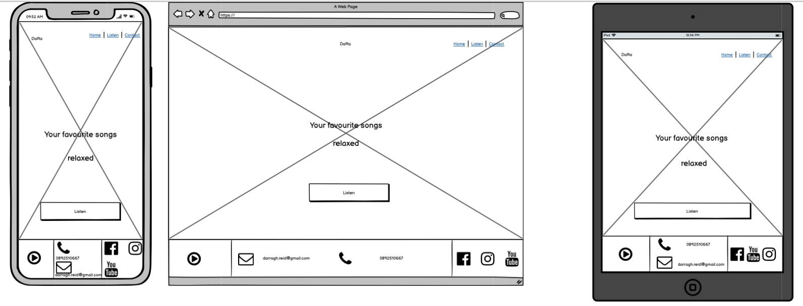
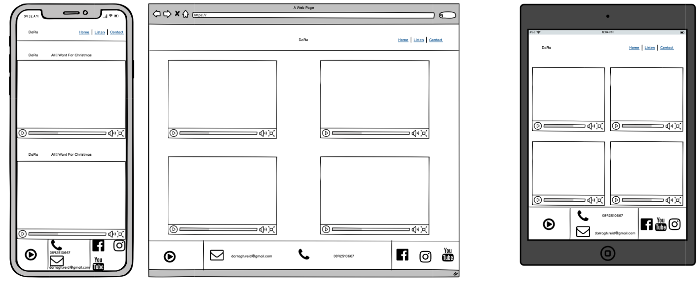
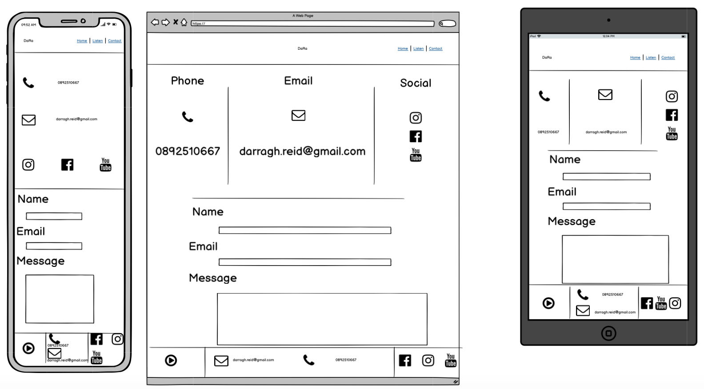

# DaRa Website
View the live project [here](https://darraghreid.github.io/dara-MS1/)

This website was created for Code Institute's Milestone 1 Project as part of the Diploma in Full Stack Web Development. 
The purpose of this project is to demonstrate the student's knowledge and skills aquired thus far in the course. 
This includes skills in HTML, CSS, as well as other User Centric Design skills as outlined in the [Technologies Used](#Technologies-Used) section.

This site was created for the musician, DaRa. It is designed for those who wish to listen to his music and contact him, if they wish. 
The site has been designed to be fully responsive across most devices and browsers.

## User Experience (UX)
* User Stories
    * First Time User Goals:  
        1. As a first time visitor, I want to immediately understand the purpose of the site.
        2. As a first time visitor, I want to be able to easily navigate through the site to find what I'm looking for.
        3. As a first time visitor, I want to instinctively know what to do in order to listen to the site owner's music.
        4. As a returning user, I want to know the best ways in which I can follow and contact the site owner.

    * Returning User Goals:  
        1. As a returning user, I want to be able to check for new videos and music.
    
    * Site Owner Goals:

        1. As the site owner, I want to be able to showcase my work.
        2. As the site owner, I want to be able to provide a platform to followers where they can stay up to date with my music.
        3. As the site owner, I want users to be be able to follow and contact me easily.
    
## Structure 
The site is designed as a single webpage with multiple sections. 
Each section is linked to in the home page as well as in call-to-action buttons throughout the site.
This should result in fast and intuitive navigation.

The navigation bar is structured from left to right in order of importance,
though the "about" and "listen" sections are swapped when scrolling for visual reasons.

## Design
* Colour Scheme
    * The colours used in this project are rgb(124, 124, 124)/dark grey, rgb(238, 229, 233)/beige-pink, and rgb(243, 178, 114)/orange-yellow.
    The beige-pink and orange-yellow compliment the colour scheme of the content (images and videos) while the dark grey offers a good dark constrast to the other two.

* Typeography
    * The fonts used throughout the site are Roboto and Big Shoulders Inline Text
    Big Shoulders Inline Text is used for the logo as well as all H1 headings,
    while Roboto is used in all other instances.

* Imagery
    * All imagery was supplied by the artist. 
    The images used in the homepage carousel were carefully chosen to give users immediate confirmation as to the type of site they are visiting.
    As mentioned in the User Stories section, it is important for users to immediately understand the purpose of the site.

        The image used in the "About" section was carefully chosen to represent who DaRa is as an artist.

## Wireframes

Wireframe of Home Page

Wireframe of "Listen" section

Wireframe of "Contant" section

### Differences between wireframes and final product.
* The most obvious difference between the wireframes and the finished site is the including of an "About" section.
I felt, in order to create a more rounded site for the artist, an about section where users can learn more about DaRa was important.

* The header of the site is more solid, and the logo is to the left rather than the center. 

* Also, since this is a single-paged site, there is just one footer.

* Instead of a single image in the homepage, I decided a manual carousel was a better option.

* The layout of the video section also deviates from the wireframe. 
The live site displays 3 videos per row on large screens, and two videos per row on medium and small screens.

* The live site also excludes horizontal lines in the "Contact" section, as opposed to the wireframes.

## Features

* Home Page 
    * The home page inclused a responsive navbar. 
    The menu items collapse into a single button on smaller screens. 
    The button would not display. The button you see in the finished site is a Fontawesome icon.

    * Another feature of the Home Page is the image carousel. 
    This is one of two carousels in the site. 
    As opposed to the carousel in the "About" section, this carousel is made solely of HTML and CSS. 
    I wanted to demonstrate that a fully functional carousel could be made without the need for Javascript or Bootstrap.

        This slider, inspired by YouTuber [Web Decorator](https://www.youtube.com/watch?v=z74ExMz-cWU), was heavily edited for the DaRa site.
        It uses radio buttons and z-index to display a different image at a time.

        There are no stylistic similarities between Web Decorator's slider and the one you see in the finished DaRa site.
        The most obvious difference between my carousel and Web Decorator's is that my carousel is designed to take up the whole viewport width and height and act as an underlay for all other HomePage content.
        This took further playing around with z-index, displays and positions to pull off.
        
        Rather than clickable divs either side of the content to navigate to the next slide, I decided to condence them down into clickable arrows.
        I felt that this would be more intuitive for users. 
        I also elected to display navigation bars rather than dots as I felt this fit better with the layout of the site.

        I also made some changes to the HTML.
        Of course, classes, labels and ids were changed to suite the site. 
        There is also more content in my carousel, and so more code had to be added. 
        For this reason, the radio buttons were given a common class to be addressed in style.css to reduce code clutter.

        Much effort was put in to centering, containing, and maintaining the aspect ratio of each of the images at different screen sizes.

    * A call to action button is also featured on the Home Page. 
    When clicked, the user is brought to the video section of the site where they can listen to the artist's music.

* About Section
    * The About section features a circular image of DaRa surrounded by three blank, circular divs with partially coloured borders.
    When hovered over, the colored parts of the borders alternate. The image also enlarges when hovered over.

    * Another feature of the About section is the information section which collapses into a carousel on smaller screens.
    For this carousel, I decided to use a Bootstrap 4 carousel template.

        Again, this carousel was heavily edited to suit the site.
        Firstly, my carousel is text based, whereas the Bootstrap carousel is imaged based. 
        Much tweaking was required here to get the text into the required positions.

        I removed the Bootstrap navigation arrows and inserted my own arrows to match the slider in the home page.
        The arrows on my carousel appear on the outside of the content rather than overlaying on top of the content, which is the case with the Bootstraps carousel.

        All styles including sizes and colours have been changed from the original Bootstrap carousel.
        The only remaining feature that bears are resemblance to the the Bootstrap template is the shape of the navigation bars at the bottom of the slider.

        There were extra slides in my carousel and so more code had to be added. 
        An extra div to contain the carousel was also needed to center the slider itself due to its modified dimensions.

        While most class names remained the same due to their built-in Bootstrap properties, the were extensively modified in the CSS.

    * The About section also contains another call-to-action button which, agian, directs users to the Listen section.

* Listen Section

    * The Listen section contains a selection of DaRa's YouTube videos.
    They were coded into the page using the iframe HTML tag and a Bootstrap grid system.
    The section is designed to display 3 videos per row on larger screens, and two videos per row on smaller screen sizes.

        Also contained in this section is a link "Watch on YouTube" which opens up DaRa's YouTube channel in a separate tab.

        The Listen section also contains a call-to-action button which directs users to the Contact section.

* Contact Section

    * The Contact section contains two separate section.
    The first section contains phone and email information, as well as DaRa's social media & YouTube links, represented by icons, which open up in separate tabs.
    This section condences into a more streamlined version on smaller screen sizes.

        The second section is a contact form which users can fill out to contact DaRa. 
        Due to the limitations of the MS1 project, where only HTML and CSS can be used, the infromation input into this form will not be sent or stored anywhere.

* Footer
    * The footer contains the sections, layed our horizonally from left to right.
    The first section is a play button icon which brings users to the video section when clicked.

        The middle section contains the phone and email information of DaRa. On larger screens the information is displayed side-by-side, whereas on smaller screens, they are placed one on top of the other.

        The third section contains DaRa's social media & YouTube links, represnted by icons, which open in separate tabs. 

Each of the features is responsive on all devices.

## Technologies Used 

### Languages Used 
* [HTML5](https://en.wikipedia.org/wiki/HTML5)
* [CSS3](https://en.wikipedia.org/wiki/CSS)

### Frameworks, Libraries & Programs Used
* [Balsamiq](https://balsamiq.com/)
    * Balsamiq was used to make the wireframes for the project
* [Bootstrap 4.3.1](https://getbootstrap.com/docs/4.3/getting-started/introduction/)
    * Bootstrap was used in conjuction with jQuery the Navbar to make it responsive and to collapse the menu items into a single button at samller screen sizes.

        Boostrap was also used along with jQuery for the carousel in the About section, as well the grid system in the Listen section.

        All of these features are discussed in the [Features](#Features) section of this README.md.
        
* [Font Awesome](https://fontawesome.com/)
    * Fontawesome was used throughout the site.
    All buttons use Fontawesome icons, as do the the h2 elements in the About section, the phone and emails symbols in the Contact section, and the social media & YouTube icons in the Contact and Footer sections. 
* [Git](https://git-scm.com/)
    * The Gitpod terminal to commit to Git and push to Github.
* [GitHub](https://github.com/)
    * Github was used to store the code from the project.
* [Google Fonts](https://fonts.google.com/)
    * The two fonts used in the project (Roboto and Big Shoulders Inline Text) were imported from Google Fonts.
* [jQuery](https://jquery.com/)
    * jQuery was used in conjuction with Boostrap on the Navbar and Carousel.

## Testing
The [W3C Markup Validator](https://validator.w3.org/) and [W3C CSS Validator Services](https://jigsaw.w3.org/css-validator/) were used to validate this project's code and to make sure there were no syntax errors in the project.

W3C Markup Validator - [Final Results](https://validator.w3.org/nu/?doc=https%3A%2F%2Fdarraghreid.github.io%2Fdara-MS1%2F)

W3C CSS Validator - [Final Results](https://jigsaw.w3.org/css-validator/validator)

### Testing User Stories from User Experience (UX) Section

* First time user goals
    1. As a first time visitor, I want to immediately understand the purpose of the site.
        * Upon entering the site, users are immediately presented with an image of the artist playing the guitar.
        * The text in the callout section is immediately visible and indicates what the site is about.
        * The "Listen" button in the callout section is also immediately visible and again indicates what the site is about.

    2. As a first time visitor, I want to be able to easily navigate through the site to find what I'm looking for.
        * The site is one page with four sections and is easy to scroll through.
        * The navigation bar contains links to all sections on the site.
        * Each section has a call-to-action button which will re-direct users to the most important sections. 
        * The Contact section does not have a call-to-action button, but is located next to a footer with a link to the Listen section, contact information, and links to social media & YouTube.
        * Links to YouTube and social media are present where appropriate throughout the site.

    3. As a first time visitor, I want to instinctively know what to do in order to listen to the site owner's music.
        * A "Listen" button with an earphones icon is clearly visible in the callout section of the home page.
        * "Listen" is also the second button in the menu in the navigation bar.

* Returning User Goals:  
    1. As a returning user, I want to know the best ways in which I can follow and contact the site owner. 
        * The contact section has clearly displayed contact information as well as a contact form from which users can send messages to DaRa.
        Due to the limitations of the project (HTML & CSS only), these messages will not be sent anywhere.
        * Links to DaRa's social media and YouTube accounts are clearly visible in the Contact section and footer.
        * DaRa's YouTube account is also easy to navigate to from the Listen section of the site.

    
* Site Owner Goals:
    1. As the site owner, I want to be able to showcase my work.
        * The Listen section offers an effective way for DaRa to showcase his music videos.

    2. As the site owner, I want to be able to provide a platform to followers where they can stay up to date with my music.
        * Users can visit this site as often as they like to check for new uploads.

    3. As the site owner, I want users to be be able to follow and contact me easily.
        The contact section offer multiple ways in which users can follow and contact DaRa.

### Further Testing
* This website was tested on Google Chrome, Safari, and Internet Explorer.
* This website was tested on a Macbook Pro, iPhone 8, Huawei p30 light, Galaxy Ao1, OnePlus 5, and a Samsung Galaxy S10.
* Extensive testing was done by the developer as well as family and friends on all screen sizes to see that the site was displaying correctly and links were working correctly.

#### Errors and warnings encountered during testing

W3C Markup Validator 

*  The first error was "Stray body tag". 
I had the body outside of the html tags.
* The next error was "The frameborder attribute on the iframe element is obsolete."
I had to removed this attribute from the HTML. However, this resulted in an unwanted frame appearing around the videos.
After some research, I addressed this issue by replacing the frameborder attribute with ' style="border:none" '.
* The next error I got was "Element div not allowed as child of element h1 in this context."
I replaced the div with a span element and set its display to "block" to fix it.
* Like the previous error, my last error was "Element p not allowed as child of element button in this context."
Again, I remedied this my replacing the p element with a span element.

* The first warning I got was "The document is not mappable to XML 1.0 due to two consecutive hyphens in a comment."
This related to my comment having too many hyphens.
* The other warning I got was "Section lacks heading. Consider using h2-h6 elements to add identifying headings to all sections."
This related to my footer section.
To fix this I simply replaced the section selement with a div element.

W3C CSS Validator
* The only error encountered in my CSS was a missing % after a or of 100 of a height property.

All errors and warnings were resolved.

#### Other bugs encountered
* On certain screens (iPad, OnePlus 5 ) The video section was elongated. 
To address this I removed the min-height property from this section.

## Deployment

### Project Creation
This project was created by using the following steps:

1. Log in to GitHub.
2. In the Repositories section, click the green "New" button.
3. Under "Repository template", select "Code-Institute-Org/gitpod-full-template".
4. Enter repository name (dara-MS1).
5. Click "Create repository".
6. When re-directed, select the green "Gitpod" button. 

### GitHub Pages
This project was deployed to GitHub Pages using the following steps:

1. Log in to GitHub.
2. Select repository.
3. Navigate to and click the "Settings" button.
4. When re-directed, scroll down to the "GitHub Pages" section.
5. Under "Source", click the dropdown named "None" and select "Master Branch".
6. Click the "Save" button.
7. Upon page refresh, scroll down and locate the link to the live deployed page.

## Credits

### Code 
* As discussed in the Features Section, the code was for the slider in the Home Page was taken from YouTuber [Web Decorator](https://www.youtube.com/watch?v=z74ExMz-cWU) and was heavily edited.
* The carousel in the About section is based off this [Bootstrap Template](https://getbootstrap.com/docs/4.5/components/carousel/) and is, again, heavily edited.

### Content 
* All content is was created by the developer.

### Media
* All videos and images were created by the developer.

### Acknowledgements
I would like to thank my mentor Gurjot Singh for his continuous support throughout the project.
I would like to thank the slack community for their assistance, particularly Daisy Mc Girr who was always willing to share her wisdom and advice.